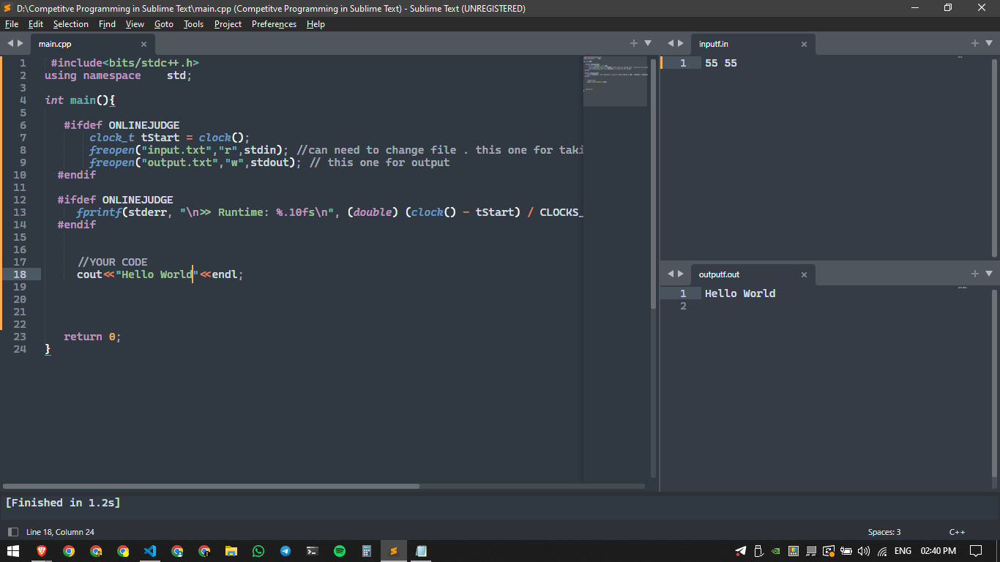

# sublime-text-setup-for-CP
Coding Environment Setup
sublime is the best text editor for Competitive Programming. Also, it is a lite weight text editor and You can use file input-output so easily Handel big input-output.

So, for setup sublime before you need to prepare your computer.

Install C/C++ compiler :
# windows
> For linux run this command. pacman is my package manager. Here you can use your package manager command. It's for arch-based Distro. sudo pacman -Syu gcc

# Mac os
> Install Sublime :
    Now it's time to install Sublime on your Computer. Goto Sublime Offical Site and download sublime for your current Operating System.

Let's Setup Our Sublime


First Do partition your sublime screen into 3 part. one is for your code and the other two is for the input and output section.


In any case, if the GIF image is not working properly then you can see from here. I host the gif in GitHub also. Open the link in the new tab.

2 . Then click Tools > Build System > New Build System Now a file will be open. In that file, you need to paste the below code.
```
{
    "shell_cmd": "g++ \"$$${file}\&quot; -o \&quot;$$${file_path}/${file_base_name}\"",
    "file_regex": "^(..[^:]*):([0-9]+):?([0-9]+)?:? (.*)$",
    "working_dir": "${file_path}",
    "selector": "source.c, source.c++",
    "variants":
    [
        {
            "name": "Run",
            "shell_cmd": "g++ -O2 -static -Wno-unused-result -std=c++17 -DONLINEJUDGE \"$$${file}\&quot; -o \&quot;$$${file_path}/$$${file_base_name}\&quot; &amp;&amp; \&quot;$$${file_path}/${file_base_name}\""
        }
    ]
}

```
Almost done!

3 . Now Save this file and remember the name of the file it will need in step 7 . and the file extension will be .sublime-build

4 . Now Create a Folder. And Make .cpp file and two .txt file. Make sure that those three files are in a directory. input.txt & output.txt

5 . Now add your Folder in sublime. Click File > Open Folder and select your folder.

When you add a file in a section then instantly save this file in that section by clicking ctr+s


6 . Now Past this is in your `main.cpp` file

```
#include<bits/stdc++.h>
using namespace    std;

int main(){

   #ifdef ONLINEJUDGE
       clock_t tStart = clock();
       freopen("input.txt","r",stdin); //can need to change file . this one for taking input
       freopen("output.txt","w",stdout); // this one for output
  #endif

       //Your Code

  #ifdef ONLINEJUDGE
     fprintf(stderr, "\n>> Runtime: %.10fs\n", (double) (clock() - tStart) / CLOCKS_PER_SEC); // this line gives your code runtime
  #endif

   return 0;
} 
```



7 . now click Tools > Build System > select file which is created in step 3. Now write an input and output code and save input in the input file.

8 . press ctrl + shift + B and a pop up will bring your sublime click one which has -Run part. WOW See you can successfully Generate your output.

9 . Now whenever you need to compile your code just click ctrl + B and you will compile and generate an output corresponding to your input.